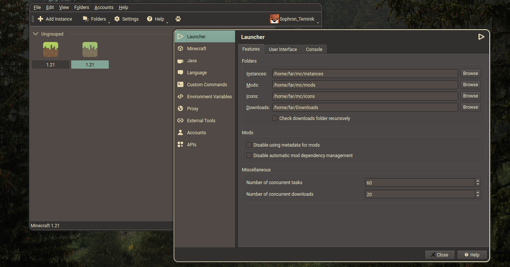

# works with all MultiMC forks!
# Description
This repository was created in case my theme and icons are not accepted in the main Prism Launcher [theme](https://github.com/PrismLauncher/Themes) repository.
## The repository includes
* Theme in gruvbox
* Icon theme in gruvbox

## support pull request in PrismLauncher/Themes: [click](https://github.com/PrismLauncher/Themes/pull/56) 

## Preview


## The themes was created
* Sophron Teminik(theme and icon pack)
* Sylwia Ptasinska(icon pack gruvbox plus)
## License gruvbox-plus icons

    GPL3 © 2021-2024 Gruvbox Plus by Sylwia Ptasinska.
    MIT © 2021-2022 Kitty icon design by Rune Warhuus.
    CC BY-SA/GPL3 © 2018-2019 Suru Icons by Sam Hewitt.
    GPL3 © 2018-2019 Suru++ Ubuntu by Andrea Bonanni and Gustavo Costa.
    GPL3 © 2018-2019 Suru++ 25 by Gustavo Costa.
    GPL3 © Tela by Vince Liuice
    GPL3 © Papirus by Alexey Varfolomeev.
    GPL3 © Numix by Numix Team.
    GPL3/MIT © 2015-2019 La Capitaine by Keefer Rourke.
    GPL3 © One Dark by Adhe
    MIT © Icons 8 by Gravit Designer
    MIT © Twemoji by Twitter Team.

## License theme gruvbox
```
GPL3 © 2024 Gruvbox theme by SophrTemin
```
